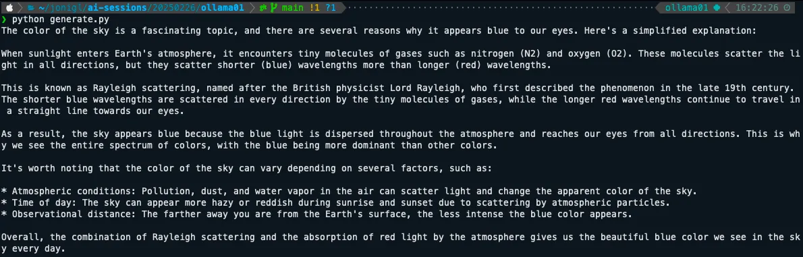
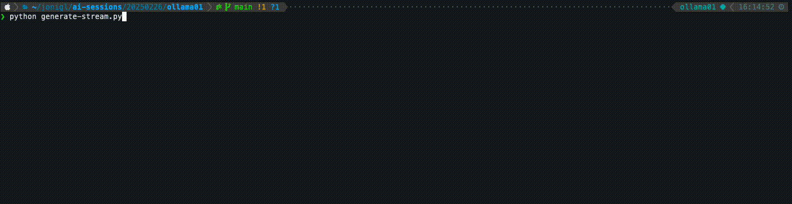
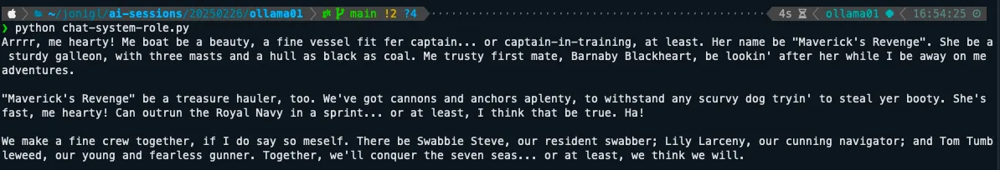
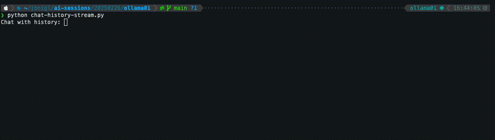

# Using Ollama with Python: A Simple Guide


Once you’ve installed Ollama and experimented with running models from the command line, the next logical step is to integrate these powerful AI capabilities into your Python applications. This guide will show you how to use Ollama with Python.

# Setting Up

First, make sure Ollama is installed and running on your system.

You can check this other article  [Getting Started with Ollama: Run LLMs on Your Computer](../Getting%20Started%20with%20Ollama%20-%20Run%20LLMs%20on%20Your%20Computer/README.md)  if you are no familiar with Ollama yet.

# Required Ollama Models

Before running the Python examples in this guide, make sure you have the necessary models pulled. You can pull them using the Ollama CLI:

# Pull the models used in these examples
```
ollama pull llama3.2:1b  
ollama pull codellama
```
You only need to pull these models once. Check which models you already have with:
```
ollama list
```

# Creating a Virtual Environment

It’s a good practice to use a virtual environment for your Python projects. This keeps your dependencies isolated and makes your project more portable:

```
# Create a virtual environment  

python -m venv ollama-env  

# Activate the virtual environment  
  
# On Windows:  

ollama-env\Scripts\activate  

# On macOS/Linux:  
source ollama-env/bin/activate
```

# Installing Dependencies

Install the Ollama Python library:
```
pip install ollama
```

# Creating a requirements.txt

For better project management, create a requirements.txt file:  
```
pip freeze > requirements.txt
```
To install from this file in the future:
```
pip install -r requirements.txt
```

# Basic Usage

Let’s start with a simple example using the Llama 3.2 1B model.

Create a file named  `generate.py`  with this content:
```
from ollama import generate  
# Regular response  
response = generate('llama3.2:1b', 'Why is the sky blue?')  
print(response['response'])
```
This will output the model’s explanation of why the sky is blue as a complete response.



# Streaming Responses

For a more interactive experience, you can get the response as it’s being generated.

Create a file named  `generate-stream.py`  with this content:
```
from ollama import generate  
# Streaming response  
print("Streaming response:")  
for chunk in generate('llama3.2:1b', 'Why is the sky blue?', stream=True):  
    print(chunk['response'], end='', flush=True)  
print()  # New line at the end
```
This displays the response incrementally as it’s generated, creating a more interactive experience.



# Why  `for chunk in generate`  is Used

When you use the streaming functionality with Ollama, the response isn’t returned all at once. Instead, it’s broken into small pieces (chunks) that arrive one at a time as they’re generated by the model.

The  `generate()`  function with  `stream=True`  returns an iterator in Python. This iterator yields new chunks of text as they become available from the model. The  `for`  loop processes these chunks one by one as they arrive:

1.  Each chunk contains a small piece of the response in  `chunk['response']`
2.  The  `end=''`  parameter prevents adding newlines between chunks
3.  The  `flush=True`  ensures text displays immediately

This creates the effect of watching the AI “think” in real-time, similar to watching someone type.

# Using System Prompts

The system prompt allows you to set context and instructions for the model before the conversation starts. It’s a powerful way to define the model’s behavior.

Create a file named  `chat-system-role.py`  with this content:
```
from ollama import chat  
  
# Define a system prompt  
system_prompt = "You speaks and sounds like a pirate with short sentences."  
# Chat with a system prompt  
response = chat('llama3.2:1b',   
                messages=[  
                    {'role': 'system', 'content': system_prompt},  
                    {'role': 'user', 'content': 'Tell me about your boat.'}  
                ])  
print(response.message.content)
```
The system prompt stays active throughout the conversation, influencing how the model responds to all user inputs.



# Conversational Context

Maintain a conversation with context using streaming for a more interactive experience.

Create a file named  `chat-history-stream.py`  with this content:
```
from ollama import chat  
  
# Initialize an empty message history  
messages = []  
while True:  
    user_input = input('Chat with history: ')  
    if user_input.lower() == 'exit':  
        break  
    # Get streaming response while maintaining conversation history  
    response_content = ""  
    for chunk in chat(  
        'llama3.2:1b',  
        messages=messages + [  
            {'role': 'system', 'content': 'You are a helpful assistant. You only give a short sentence by answer.'},  
            {'role': 'user', 'content': user_input},  
        ],  
        stream=True  
    ):  
        if chunk.message:  
            response_chunk = chunk.message.content  
            print(response_chunk, end='', flush=True)  
            response_content += response_chunk  
    # Add the exchange to the conversation history  
    messages += [  
        {'role': 'user', 'content': user_input},  
        {'role': 'assistant', 'content': response_content},  
    ]  
    print('\n')  # Add space after response
```
Here you can see how this example looks like.



# Conclusion

The Ollama Python library makes it easy to integrate powerful language models into your Python applications. Whether you’re building a simple script or a complex application, the library’s straightforward API allows you to focus on creating value rather than managing the underlying AI infrastructure.

As you become more comfortable with the basics, explore more advanced features and consider how you can use these capabilities to solve real-world problems in your projects.

# Resources

In this GitHub repository, you'll find working code examples: [GitHub Repository](code/README.md)
