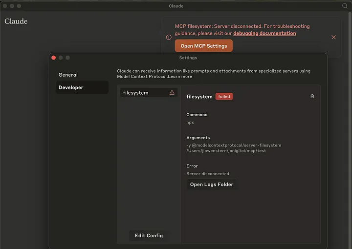

# **MCP filesystem: Server disconnected**



If you’re excited about using your Claude Desktop app with the new Model Context Protocol (MCP) but keep running into frustrating configuration errors, you’re not alone. This is especially common if you’re a Node Version Manager (nvm) user.

## The Problem

You followed the “Quickstart guide: For Claude Desktop User,” carefully copied the JSON configuration into your own  `claude_desktop_config.json`  file, but it keeps failing repeatedly.

You’ll likely see this specific error alert:  **“MCP filesystem: Server disconnected”**

After some investigation, I discovered the root cause from a comment in the project’s GitHub repository (see Sources section below):

**The MCP Server Commands environment cannot directly access Node.js executables installed via nvm unless they are properly configured.**

## The Solution: Create a Wrapper Script

This elegant solution creates a wrapper script that ensures the correct Node.js environment is used:

## Step 1: Find your Node.js path

First, determine your nvm-installed Node.js path:

```bash
which node
```

This will return something like:  `/Users/username/.nvm/versions/node/v16.x.x/bin/node`

## Step 2: Create a wrapper script

Create a new file at  `/usr/local/bin/npx-for-claude`  with the following content:
```bash
##!/usr/bin/env bash  
  
export PATH="/Users/YOUR-USERNAME/.nvm/versions/node/YOUR-NODE-VERSION/bin:$PATH"  
exec npx "$@"
```
Make sure to replace:

-   `YOUR-USERNAME`  with your actual username
-   `YOUR-NODE-VERSION`  with your actual Node.js version (e.g., v16.20.0)

## Step 3: Make the wrapper script executable

```bash
chmod +x /usr/local/bin/npx-for-claude
```

## Step 4: Configure Claude Desktop

Edit your  `claude_desktop_config.json`  file to use the wrapper script:
```json
{  
    "mcpServers": {  
        "filesystem": {  
            "command": "npx-for-claude",  
            "args": [  
                "-y",  
                "@modelcontextprotocol/server-filesystem",  
                "/Users/username/path/to/allowed/directory"  
            ]  
        }  
    }  
}
```

## Final Step

Restart your Claude Desktop app, and it should start working with the new configuration!

## Why This Works

This solution works because:

1.  The wrapper script sets up the correct PATH environment that includes your nvm-installed Node.js binaries
2.  It then executes the  `npx`  command with all the arguments passed to it

The wrapper script essentially bridges the gap between Claude Desktop’s execution environment and your nvm setup, allowing you to use the standard configuration pattern recommended in the documentation.

## Source

This solution was inspired by some comments in the ModelContextProtocol GitHub repository:  [Issue #64](https://github.com/modelcontextprotocol/servers/issues/64#issuecomment-2611032995)

I have also added this solution as a comment on this GitHub issue:  [comment](https://github.com/modelcontextprotocol/servers/issues/64#issuecomment-2730913259)
