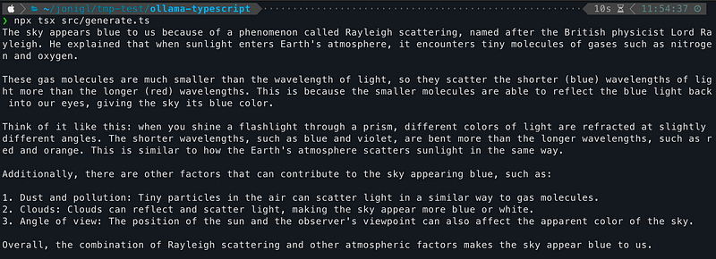
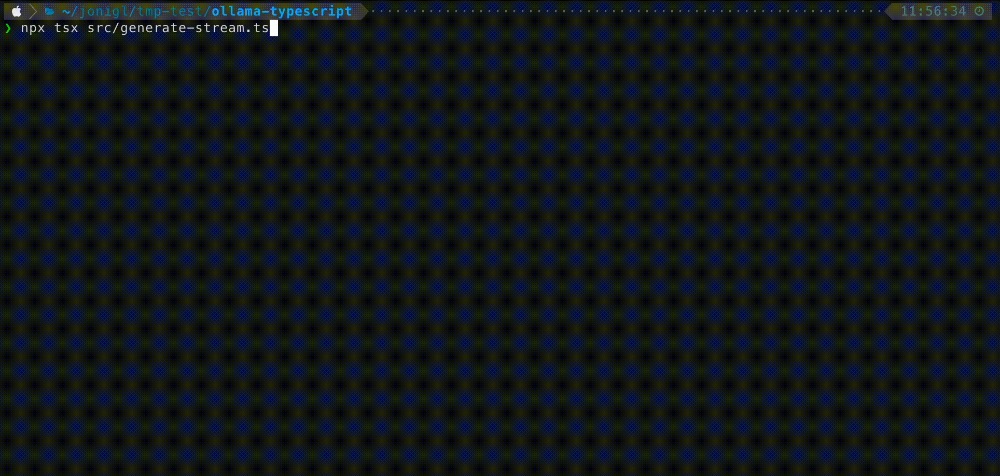
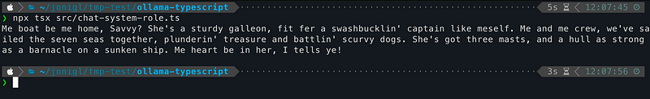
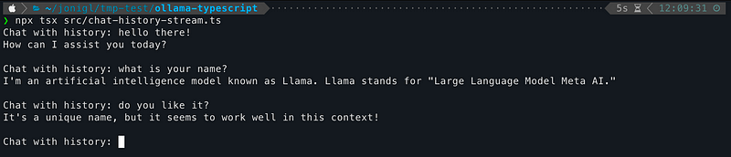

# Using Ollama with TypeScript: A Simple Guide


Once you've installed Ollama and experimented with running models from the command line, the next logical step is to integrate these powerful AI capabilities into your TypeScript applications. This guide will show you how to use Ollama with TypeScript.

> Note: If you prefer Python, check out my other guide: [Using Ollama with Python: A Simple Guide](../../02/Using%20Ollama%20with%20Python%20-%20A%20Simple%20Guide/README.md)

# Setting Up

First, make sure Ollama is installed and running on your system.

You can check this other article [Getting Started with Ollama: Run LLMs on Your Computer](../../02/Getting%20Started%20with%20Ollama%20-%20Run%20LLMs%20on%20Your%20Computer/README.md) if you are not familiar with Ollama yet.

# Required Ollama Models

Before running the TypeScript examples in this guide, make sure you have the necessary models pulled. You can pull them using the Ollama CLI:

```
# Pull the models used in these examples
ollama pull llama3.2:1b  
```

You only need to pull these models once. Check which models you already have with:

```
ollama list
```

# Setting Up Your TypeScript Project

Let's create a new TypeScript project to work with Ollama:

```bash
# Create a new directory for your project
mkdir ollama-typescript
cd ollama-typescript

# Initialize a new Node.js project
npm init -y

# Install TypeScript and tsx for running TypeScript files
npm install typescript @types/node --save-dev
npm install tsx --save-dev

# Install the Ollama library
npm install ollama
```

Next, create a TypeScript configuration file (`tsconfig.json`):

```json
{
  "compilerOptions": {
    "target": "ES2020",
    "module": "NodeNext",
    "moduleResolution": "NodeNext",
    "esModuleInterop": true,
    "strict": true,
    "outDir": "./dist"
  },
  "include": ["src/**/*"]
}
```

Create a `src` directory for your TypeScript files:

```bash
mkdir src
```

# Basic Usage

Let's start with a simple example using the Llama 3.2 1B model.

Create a file named `src/generate.ts` with this content:

```typescript
import { Ollama } from "ollama";

async function main() {
  const ollama = new Ollama();
  
  // Regular response
  const response = await ollama.generate({
    model: "llama3.2:1b",
    prompt: "Why is the sky blue?"
  });
  
  console.log(response.response);
}

main().catch(console.error);
```

Run this example with:

```bash
npx tsx src/generate.ts
```

This will output the model's explanation of why the sky is blue as a complete response.



# Streaming Responses

For a more interactive experience, you can get the response as it's being generated.

Create a file named `src/generate-stream.ts` with this content:

```typescript
import { Ollama } from "ollama";

async function main() {
  const ollama = new Ollama();
  
  console.log("Streaming response:");
  
  // Streaming response
  const stream = await ollama.generate({
    model: "llama3.2:1b",
    prompt: "Why is the sky blue?",
    stream: true
  });
  
  for await (const chunk of stream) {
    process.stdout.write(chunk.response);
  }
  
  console.log(); // New line at the end
}

main().catch(console.error);
```

This displays the response incrementally as it's generated, creating a more interactive experience.



# How Streaming Works in TypeScript

When you use the streaming functionality with Ollama in TypeScript, the response is returned as an `AsyncIterable` that you can consume with a `for await...of` loop.

The `ollama.generate()` function with `stream: true` returns an `AsyncIterable` in TypeScript. This allows you to process each chunk as it becomes available from the model:

1. Each chunk contains a small piece of the response in `chunk.response`
2. Using `process.stdout.write()` prevents adding newlines between chunks
3. The chunks are displayed immediately as they arrive

This creates the effect of watching the AI "think" in real-time, similar to watching someone type.

# Using System Prompts

The system prompt allows you to set context and instructions for the model before the conversation starts. It's a powerful way to define the model's behavior.

Create a file named `src/chat-system-role.ts` with this content:

```typescript
import { Ollama } from "ollama";

async function main() {
  const ollama = new Ollama();
  
  // Define a system prompt
  const systemPrompt = "You speak and sound like a pirate with short sentences.";
  
  // Chat with a system prompt
  const response = await ollama.chat({
    model: "llama3.2:1b",
    messages: [
      { role: "system", content: systemPrompt },
      { role: "user", content: "Tell me about your boat." }
    ]
  });
  
  console.log(response.message.content);
}

main().catch(console.error);
```

The system prompt stays active throughout the conversation, influencing how the model responds to all user inputs.



# Conversational Context

Maintain a conversation with context using streaming for a more interactive experience.

Create a file named `src/chat-history-stream.ts` with this content:

```typescript
import { Ollama } from "ollama";
import * as readline from "readline";

async function main() {
  const ollama = new Ollama();
  
  // Initialize an empty message history
  const messages: Array<{ role: string, content: string }> = [];
  
  const rl = readline.createInterface({
    input: process.stdin,
    output: process.stdout
  });
  
  const askQuestion = () => {
    rl.question("Chat with history: ", async (userInput) => {
      if (userInput.toLowerCase() === "exit") {
        rl.close();
        return;
      }
      
      // Get streaming response while maintaining conversation history
      let responseContent = "";
      
      const stream = await ollama.chat({
        model: "llama3.2:1b",
        messages: [
          ...messages,
          { role: "system", content: "You are a helpful assistant. You only give a short sentence by answer." },
          { role: "user", content: userInput }
        ],
        stream: true
      });
      
      for await (const chunk of stream) {
        if (chunk.message) {
          const responseChunk = chunk.message.content;
          process.stdout.write(responseChunk);
          responseContent += responseChunk;
        }
      }
      
      // Add the exchange to the conversation history
      messages.push(
        { role: "user", content: userInput },
        { role: "assistant", content: responseContent }
      );
      
      console.log("\n"); // Add space after response
      askQuestion();
    });
  };
  
  askQuestion();
}

main().catch(console.error);
```

Here you can see how this example looks like.



# Conclusion

The Ollama TypeScript library makes it easy to integrate powerful language models into your TypeScript and JavaScript applications. Whether you're building a simple script, a Node.js application, or integrating AI into a web app, the library's straightforward API allows you to focus on creating value rather than managing the underlying AI infrastructure.

As you become more comfortable with the basics, explore more advanced features and consider how you can use these capabilities to solve real-world problems in your projects.

# Resources

In this GitHub repository, you'll find working code examples: [GitHub Repository](code/README.md)
