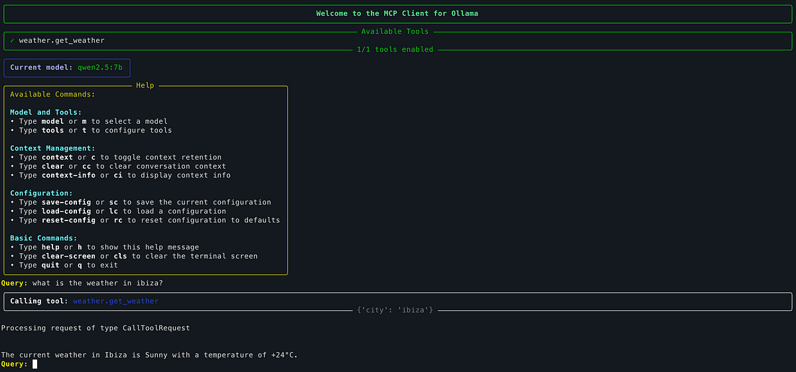

# How to Build Your First MCP Server (Fast)


## Introduction

If you’ve landed on this article, you’re probably wondering: _“What’s all this MCP stuff about?”_ and _“Why is it getting so much hype lately?”_ Or maybe you already have an idea and just want to build your own MCP server to let LLMs interact with your tools. So, let’s quickly answer the basics to get on the same page and then jump right into building your first MCP Server.

### What’s all this MCP stuff about?

At this point you probably know what **MCP** is, but if you don’t, no worries - I’ve got you covered. MCP was introduced last year by Anthropic (the company behind Claude) and stands for **Model Context Protocol** It might sound complex at first, but it’s actually quite simple. MCP is a way to let **LLMs** (**Large Language Models**) interact with tools in a open standard way, allowing them to get context from different data sources and even execute tasks on you behalf, so building agents is just around the corner.

### Why is it getting so much hype lately?

Answering this isn’t easy, because everyone has their own take. But here’s the deal: MCP gives the **community** a **standard** way to build connectors for AI apps, so you don’t have to build everything yourself. Most tools can be **plug-and-play.** Third-party services can run their own servers, and you can use them without needing custom implementations. That **simplicity** is what’s getting everyone excited and backing MCP as the go-to standard.

## Clock is ticking, How can I build my first MCP Server (Fast!)?

First of all, we need to decide what tool we want to make available to LLMs. Let’s keep it simple and just create a get weather by city tool which is kind of a “hello world” example. For this we will use wttr.in and as they say, they are “the right way to check curl the weather!” and it will allow us to create this weather server really straightforward!

Now that we know what tool we want to build, we need to select one of the **SDKs** available. I will pick one for you this time, selecting the **python** one for our first server.

We will use [**uv**](https://github.com/astral-sh/uv?tab=readme-ov-file#installation) to manage our **Python project**. Open your favorite terminal and follow me on these commands. Let’s create a project together:

> If you are not familiar with **uv** you can check [this page](https://github.com/astral-sh/uv?tab=readme-ov-file#installation) and learn how to use it and install it.

```bash
uv init weather-mcp-server  
cd weather-mcp-server
```

Add the mcp dependency to your project:

```bash
uv add "mcp[cli]"
```

Now we need a file to write our MCP server code:

```bash
touch weather-server.py
```

Nice, we are ready to start writing code! Open this file in your favorite code editor. If you’re new to **decorators** or **docstrings**, pay extra attention to those parts , they’re key to how tools are defined and described for the LLM. So, don’t forget to take a look on the comments.

```python
# FastMCP is all what we need from mcp dependency  
from mcp.server.fastmcp import FastMCP  
# We will use this lib to request the weather from wttr.in   
import urllib  
  
# Now lets create an MCP Server  
mcp = FastMCP("Weather")  
  
# Now let's register a tool with this decorator,   
@mcp.tool()  
def get_weather(city: str) -> str: # define a function with city argument  
  # And now we will docuement this cuntion using Python Docstrings  
  # FastMCP will add this documentation to the LLM so it can decide when to use  
  # this tool and how to use it.  
  """  
  Get the current weather for a given city  
  Args:  
    city (str): The name of the city  
  Returns:  
    str: The current weather in the city, for example, "Sunny +20°C"  
  """  
  try:  
    # URL-encode the city name.  
    url_encoded_city = urllib.parse.quote_plus(city)  
    # Prepare wittr url request  
    wttr_url = f'https://wttr.in/{url_encoded_city}?format=%C+%t'  
    # Request weather  
    response = urllib.request.urlopen(wttr_url).read()    
    return response.decode('utf-8')  
  except Exception as e:  
    # If something goes wrong we let the LLM know about it  
    return f"Error fetching weather data"  
  
# And here we add the main entry point for the server  
if __name__ == "__main__":  
  # Here we initialize and run the server  
  # We select stdio transport for process-based communication.   
  # This allow a process (the client) to communicate with its parent   
  # process through pipes using standard input/output.  
  mcp.run(transport='stdio')
```

Yay! We have our first MCP server ready!

## Using your MCP Server

Now we need to prepare a configuration **JSON file** to let local **MCP clients** like Claude Desktop, vscode, etc know how to execute your server.

Let’s create a file named `mcp-servers-config.json`:
```json
{  
  "mcpServers": {  
    "weather": {  
      "command": "uv",  
      "args": [  
        "--directory",  
        "/REPLACE/ME/WITH/THE/dir/path/to/your/mcp/weather-server/",  
        "run",  
        "weather-server.py"  
      ]  
    }  
  }  
}
```

> Make sure you are replacing `/REPLACE/ME/WITH/THE/dir/path/to/your/mcp/weather-server/` with the directory where you have your `weather-server.py` file.

At this point we only need to find a **MCP client** to test it. I have written one that works with **Ollama** called **[ollmcp](https://github.com/jonigl/mcp-client-for-ollama)**, let’s use it here for simplicity since it can be executed in any terminal and it is **open source**.

> If you are not familiar with Ollama you can check my article [Getting Started with Ollama: Run LLMs on Your Computer](https://medium.com/@jonigl/getting-started-with-ollama-run-llms-on-your-computer-915ba084918c)
> Ollama is a great starting point because it’s easy to set up locally and supports llm models that can run locally and use tools through MCP.

Let’s install the MCP client

```bash
pip install ollmcp
```

I recommend using the **[qwen2.5:7b](https://ollama.com/library/qwen2.5)** model, but you can use any Ollama model that supports tools.

```bash
ollama pull qwen2.5:7b
```

Run the MCP client using our JSON configuration pointing to our MCP Sever and the model we want to use:

```bash
# if you are in the same directory as the json file execute it like this  
ollmcp --servers-json mcp-servers-config.json --model qwen2.5:7b # run it  
  
# Pro tip: ollmcp --help
```

This command will execute the `ollmcp` MCP client showing you the MCP server and tools available for your ollama model while you can interact with it writing queries where the LLM can use your MCP Servers. Here you can see how this tool interface looks like:

This command will run the `ollmcp` MCP client, showing your MCP server and tools available for your Ollama model. You can interact by writing queries, and the LLM will decide when to use your MCP server.


_Here you can see how **ollmcp** interface looks like when started_

As you can see on the screenshot we have `1/1 tools enabled`, which is great! you can see that our `weather` MCP Server gets listed with one tool called `get_weather`.

Try writing something like: `What is the weather in Ibiza?` and hit return. It might take some time depending on the model and your machine’s resources.



The LLM will seamlessly call your tool, grab the response from your MCP Server, and craft a complete answer for you. Congrats, you have your first MCP Server working!

If you like `ollmcp`, you can check out the repo here: [https://github.com/jonigl/mcp-client-for-ollama](https://github.com/jonigl/mcp-client-for-ollama)

### Conclusion

MCP servers are super easy to build and let you share your APIs, apps, or tools with different AI applications without much hassle. And if you’re making an AI app yourself, you can tap into the huge number of ready-to-go MCP servers out there , no need to build or maintain everything from scratch!

Now you’re ready to build even more powerful tools for your AI!

If you like it this article you can leave a ⭐️

## What's next?

-   Try different MCP Servers. Check out the [official and community list of MCP servers](https://github.com/modelcontextprotocol/servers) to find new servers to connect with.
-   Explore different MCP Clients too! You can continue using [ollmcp](https://github.com/jonigl/mcp-client-for-ollama) as we did earlier, or try other clients like [Claude Desktop](https://claude.ai/download), [Visual Studio Code](https://code.visualstudio.com/), and more to see how different environments interact with your server.
-   Build your own MCP Server. Base it on what you learned in this article, or dive deeper with the [official documentation](https://modelcontextprotocol.io/introduction).
-   Write your own MCP Client! I’ll be publishing a new article focused on this topic soon. Let me know in the comments if you’re interested!

## Resources

### MCP Server code

You can also find this MCP Server code in my following [GitHub repo](code/README.md).

## Acknowledgments

Big thanks to:

-   [**Ollama**](https://ollama.com/) for providing an awesome local platform to run LLMs easily.
-   [**Model Context Protocol (MCP)**](https://modelcontextprotocol.io/) for creating a powerful open standard to connect LLMs with external tools.
-   [**wttr.in**](https://wttr.in/) for offering a simple and reliable weather API service used in our example.
