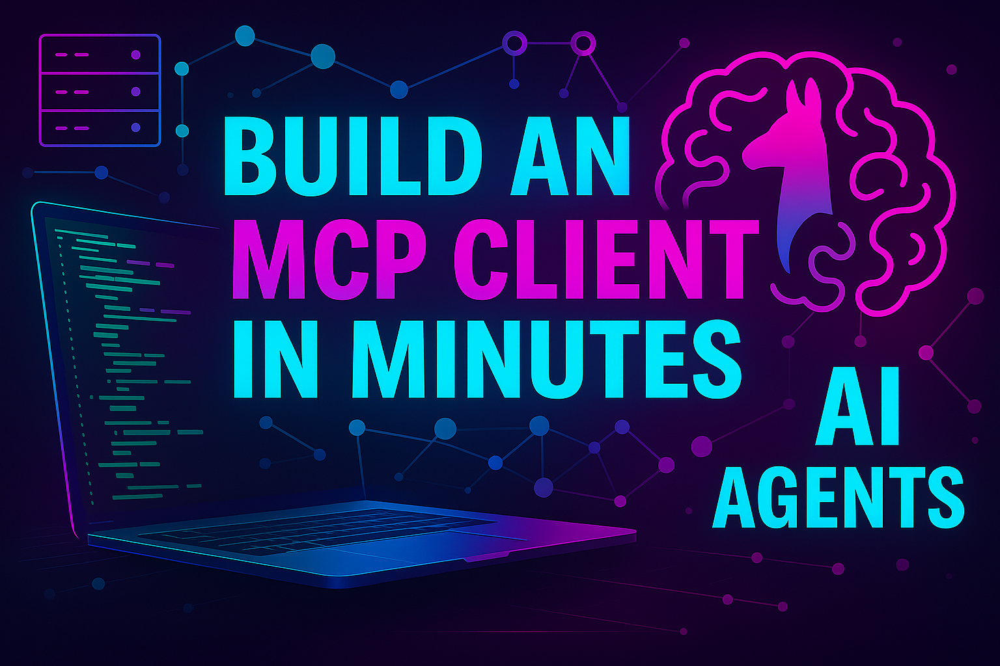
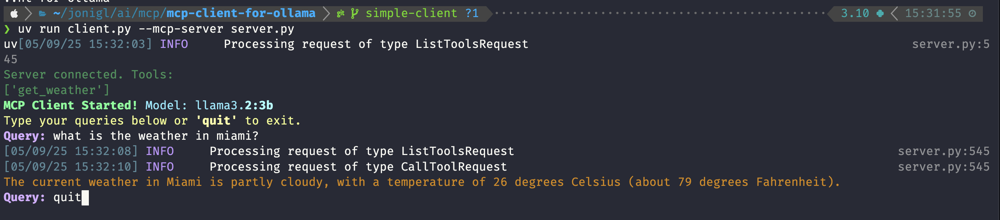

# Build an MCP Client in Minutes: Local AI Agents Just Got Real



Built an MCP server already? well done! But it's only half the story. Without a client your model is shouting into the void.

Give me **8 minutes** and you'll:

* **Ship a full MCP client in under 100 lines**
* **First steps into the world of local AI agents**
* **Plug it into any MCP server**
* **Keep every byte local. No cloud fees.**
* **Privacy first. No API keys.**

## Why roll your own client?

Cloud agents are fun until the bill hits, and who really knows where your data ends up. A local MCP client means:

1. **Full privacy & control.** Every token lives on your machine, nowhere else.
2. **Zero API keys.** No provider lock‑in, no surprise invoices.
3. **Good‑enough performance today, better tomorrow.** Local models aren’t GPT‑4o yet, but they’re getting sharper every release.

The code below is *inspired* by the [official MCP client quickstart](https://modelcontextprotocol.io/quickstart/client) (which targets Anthropic models) and tweaked for Ollama so every byte runs offline. **Let's build! 🚀**

## Requirements

* Python 3.10+ (uv handles the virtual env)

* Ollama installed, follow the [official install guide](https://ollama.com/)

* A local model pulled, the client defaults to `llama3.2:3b`; run `ollama pull llama3.2:3b` or switch with `--model`

## Quick setup with uv

```bash
# 1. create project folder
mkdir simple-mcp-client && cd simple-mcp-client

# 2. init uv (fast Python package manager)
uv init

# 3. create & activate virtual env
uv venv
source .venv/bin/activate

# 4. add deps
uv add mcp ollama rich

# 5. drop in the two files
client.py   # we will code this on this article
server.py   # from this repo https://github.com/jonigl/mcp-client-for-ollama/blob/simple-client/server.py

# 6. run it
uv run client.py --mcp-server server.py
```

Five commands and you're chatting locally ⚡️

## The 93‑line client

Below is the heart of our client. Copy it, paste it, run it. I'll highlight the spicy parts right after.

```python
# client.py
import argparse
import asyncio
from contextlib import AsyncExitStack
import ollama
from ollama import ChatResponse
from mcp import ClientSession, StdioServerParameters
from mcp.client.stdio import stdio_client
from rich.console import Console
from rich.markdown import Markdown
from typing import Optional

class MCPClient:
    # Initialize the MCP client with a model and console
    def __init__(self, model: str = "llama3.2:3b"):              
        self.console = Console()
        self.exit_stack = AsyncExitStack()
        self.model = model
        self.ollama = ollama.AsyncClient()
        self.session: Optional[ClientSession] = None

    # Connect to the MCP server using the provided script path
    async def connect_to_server(self, server_script_path: str):        
        is_python = server_script_path.endswith('.py')
        is_js = server_script_path.endswith('.js')
        if not (is_python or is_js):
            raise ValueError("Server script must be a .py or .js file")

        command = "python" if is_python else "node"
        server_params = StdioServerParameters(command=command, args=[server_script_path], env=None)
        stdio_transport = await self.exit_stack.enter_async_context(stdio_client(server_params))
        self.stdio, self.write = stdio_transport
        self.session = await self.exit_stack.enter_async_context(ClientSession(self.stdio, self.write))
        await self.session.initialize()

        # List tools
        meta = await self.session.list_tools()
        self.console.print("Server connected. Tools:", [t.name for t in meta.tools], style="dim green")

    # Process a query by sending it to the model and handling tool calls
    async def process_query(self, query: str) -> str:
        messages = [{"role": "user", "content": query}]
        meta = await self.session.list_tools()
        tools_meta = [{"type": "function", "function": {"name": t.name, "description": t.description, "parameters": t.inputSchema}} for t in meta.tools]

        # Initial call
        resp: ChatResponse = await self.ollama.chat(model=self.model, messages=messages, tools=tools_meta)
        final = []
        if getattr(resp.message, "content", None):
            final.append(resp.message.content)
        # Check for tool calls
        elif resp.message.tool_calls:
            for tc in resp.message.tool_calls:
                # Call the tool
                result = await self.session.call_tool(tc.function.name, tc.function.arguments)
                messages.append({"role": "tool", "name": tc.function.name, "content": result.content[0].text})                
                # Call the model again with the tool result, so we can get the final answer. Max tokens is set to 500 speed up the process. Adjust as needed.
                resp = await self.ollama.chat(model=self.model, messages=messages, tools=tools_meta, options={"max_tokens": 500})
                final.append(resp.message.content)
        return "".join(final)

    # Main loop for user interaction
    async def chat_loop(self):
        self.console.print("[bold green]MCP Client Started![/bold green] [cyan]Model: {}[/cyan]".format(self.model))
        self.console.print("[yellow]Type your queries below or [bold]'quit'[/bold] to exit.[/yellow]")
        while True:
            q = self.console.input("[bold blue]Query:[/bold blue] ").strip()
            if q.lower() == 'quit':
                break
            try:
                ans = await self.process_query(q)
                self.console.print(Markdown(ans, style="orange3"))
            except Exception as e:
                self.console.print("Error:", e, style="bold red")

    async def cleanup(self):
        await self.exit_stack.aclose()

# Main function to parse arguments and run the client
async def main():
    p = argparse.ArgumentParser()
    p.add_argument("--mcp-server", required=True)
    p.add_argument("--model", default="llama3.2:3b")
    args = p.parse_args()
    client = MCPClient(model=args.model)
    try:
        await client.connect_to_server(args.mcp_server)
        await client.chat_loop()
    finally:
        await client.cleanup()

if __name__ == "__main__":
    asyncio.run(main())
```

### Run it

```bash
uv run client.py --mcp-server server.py
```

Ask something like:

```
What's the weather in Tokyo?
```

If your server exposes `get_weather`, the model silently calls it and answers like a pro. That's **MCP + Ollama** working together on your desk.


_Here you can see how it looks like!_ 🤩

## How it works

* **connect_to_server** launches the mcp server (`python` or `node`) and chats over stdio.
* **list_tools** grabs available tools and hands them to Ollama as function specs.
* **process_query** lets the model decide, executes the chosen tool, then loops back for the final reply.

Same pattern big providers use, but running locally, though latency depends on your hardware and the model you load.

## Want turbo mode?

I’ve expanded this simple MCP client into a more feature-rich CLI tool called `ollcmp`. Check it out in my repo 👉 **[mcp-client-for-ollama](https://github.com/jonigl/mcp-client-for-ollama)**.

### Quickstart with `ollcmp`

Run it instantly with:

```bash
uvx ollcmp
```

Or install it globally for easy access:

```bash
pip install ollcmp --upgrade
```

`ollcmp` ships with:

* 🌐 **Multi‑Server Support** — connect to several MCP servers at once
* 🎨 **Rich Terminal UI** — slick interactive console
* 🚀 **Dynamic Model Switching** — swap any installed Ollama model on the fly
* 🛠️ **Tool Management** — toggle tools or whole servers mid‑chat
* 🔄 **Cross‑Language Servers** — Python *and* JavaScript MCP servers work out of the box
* 🔌 **Plug‑and‑Play** — point at any MCP‑compliant server and go

And if you want just fork it, bend it, contribute it.

If you found this helpful, consider giving it a ⭐️ on GitHub to show your support!

## Next moves

* Browse the [official MCP server list](https://github.com/modelcontextprotocol/servers) and plug one in.
* Try other Ollama models (for example qwen2.5:7b).
* Wrap your own script in MCP and watch your LLM gain a superpower.

**Clone it, hack it, show it off.** Drop a link to your build below and let’s continue learning together.

## Resources

### Grab the full example 

All the code with the `client.py`, a ready-to-run `server.py`, plus the `uv` project scaffold—is on GitHub:

👉 **https://github.com/jonigl/mcp-client-for-ollama/tree/simple-client**

Clone it, run it, and start wiring your own tools in minutes 🙌

### Check out the asciinema demo

[](https://asciinema.org/a/718592)

### Want to know how to build an MCP server?

You can check out my article on how to build an MCP server in minutes here: [Your first MCP Server (quick)](../../04/Your%20first%20MCP%20Server (quick)/README.md).
